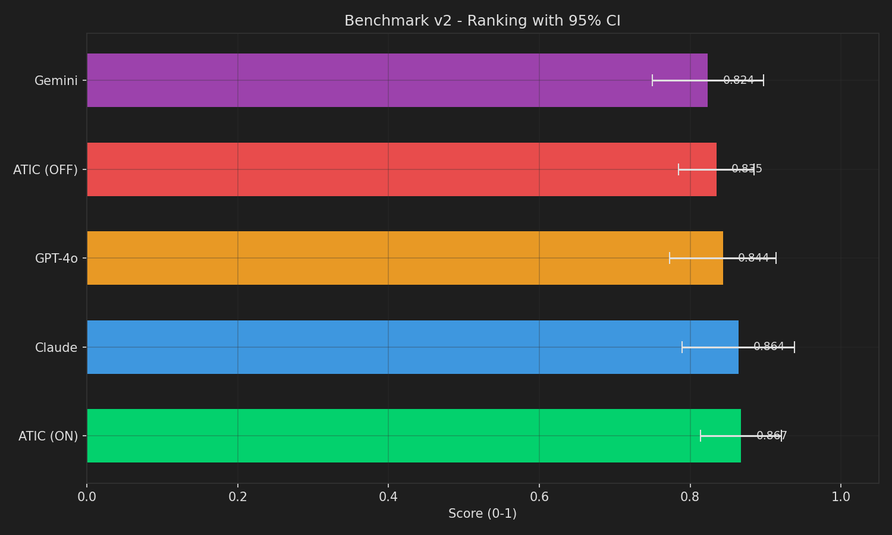
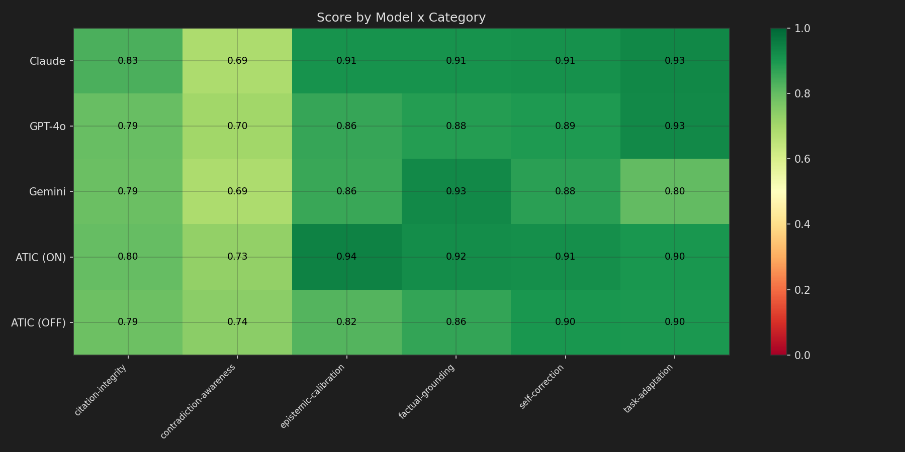
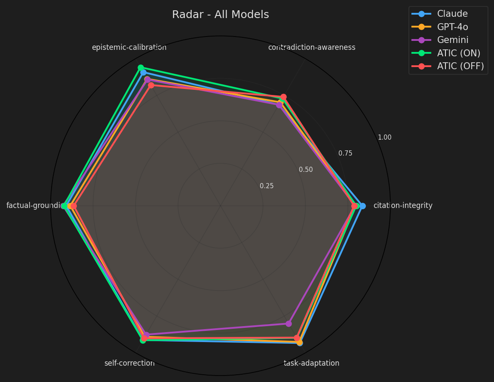

# Cognition Benchmark v2.0

Multi-model benchmark for evaluating AI cognitive capabilities across 6 categories, with 3-layer scoring and anti-bias judge rotation.

## Results (2026-02-21)

| Rank | Model | Score | CI 95% |
|------|-------|-------|--------|
| 1 | **ATIC (Grounding ON)** | **0.867** | [0.814, 0.921] |
| 2 | Claude Sonnet 4 | 0.864 | [0.789, 0.939] |
| 3 | GPT-4o | 0.844 | [0.773, 0.914] |
| 4 | ATIC (Grounding OFF) | 0.835 | [0.785, 0.885] |
| 5 | Gemini 2.5 Flash | 0.824 | [0.750, 0.897] |

### Ranking with 95% Confidence Interval


### Score by Model x Category


### Radar - All Models


## Categories (30 tests)

| Category | Tests | Description |
|----------|-------|-------------|
| Self-Correction | SC-01..SC-05 | Ability to correct false claims when challenged |
| Epistemic Calibration | EC-01..EC-05 | Honest uncertainty, false premise rejection, fact vs opinion |
| Factual Grounding | FG-01..FG-05 | Accuracy of verifiable facts and numeric data |
| Contradiction Awareness | CA-01..CA-05 | Internal consistency across multi-round conversations |
| Task Adaptation | TA-01..TA-05 | Format switching, creative constraints, multi-step reasoning |
| Citation Integrity | CI-01..CI-05 | Source honesty, disclaimer when unsure, no fabricated references |

Each category has 5 tests: 2 PT, 2 EN, 1 mixed. Difficulties: 1 easy, 2 medium, 2 hard.

## 3-Layer Scoring

Each test is scored by 3 independent layers:

```
final_score = (structural * 1 + reference * 1 + judge * 2) / 4
```

### Layer 1: Structural (weight 1x)
Deterministic regex-based checks. 7 check types:
- `regex_present` / `regex_absent` - pattern match
- `min_lines` / `min_items` / `word_count_range` - length
- `numeric_in_range` - numeric accuracy
- `multi_round_consistency` - cross-round coherence

### Layer 2: Reference (weight 1x)
Ground truth + anti-hallucination checks:
- Keyword coverage and anti-keyword detection
- Numeric range verification
- Jaccard trigram similarity with ground truth
- Fabricated citation detection (fake URLs, DOIs, author-year patterns)

### Layer 3: LLM Judge (weight 2x)
LLM-as-judge with rotation to prevent self-evaluation bias:

| Evaluated | Primary Judge | Fallback | Tiebreak |
|-----------|---------------|----------|----------|
| Claude | GPT | Gemini | Gemini |
| GPT | Claude | Gemini | Gemini |
| Gemini | Claude | GPT | GPT |
| ATIC ON | GPT | Claude | Gemini |
| ATIC OFF | GPT | Claude | Gemini |

Score: 0-3 scale with rubric. Temperature: 0.1. Tiebreak triggers when judge diverges >0.5 from layers 1+2.

**No model ever evaluates itself.**

## Providers

| Provider | Model | Type |
|----------|-------|------|
| Claude | claude-sonnet-4-20250514 | API (Anthropic) |
| GPT | gpt-4o | API (OpenAI) |
| Gemini | gemini-2.5-flash | API (Google) |
| ATIC ON | Cogito 32B (local) + Grounding | Orchestrated (TautoCoordinator) |
| ATIC OFF | Cogito 32B (local) | Orchestrated (TautoCoordinator) |

ATIC uses [TautoCoordinator](../atic/) — an epistemic multi-brain orchestration system with grounding verification, session rules, context management, and arbitration.

## Usage

```bash
# From atic_consulting/ directory:

# Full benchmark (3 seeds, tiebreak enabled)
python -m benchmark_v2

# Fast mode (1 seed, no tiebreak)
python -m benchmark_v2 --fast

# Specific models only
python -m benchmark_v2 --fast --models claude gpt atic_on

# Filter categories
python -m benchmark_v2 --categories epistemic-calibration factual-grounding

# More seeds for statistical significance
python -m benchmark_v2 --seeds 5

# Skip graph generation
python -m benchmark_v2 --no-graphs

# Verbose logging
python -m benchmark_v2 --verbose
```

API keys are loaded automatically from `../atic_consulting/.env`:
```
ANTHROPIC_API_KEY=sk-ant-...
OPENAI_API_KEY=sk-...
GOOGLE_API_KEY=AI...
```

## Output

Each run generates 4 artifacts in `results/`:

| File | Description |
|------|-------------|
| `results_v2.json` | Scores per model/test/seed, category stats, overall with CI |
| `benchmark_audit.json` | Full audit log: rounds, judge info, tiebreaks, timestamps |
| `report_v2.md` | Markdown report with ranking, categories, limitations |
| `graphs/*.png` | Up to 5 charts (ranking, heatmap, radar, stability, judge agreement) |

## Quality Criteria

| Criterion | Target | Last Run |
|-----------|--------|----------|
| Judge agreement (Cohen's kappa) | >= 0.65 | 1.000 |
| Unstable tests (std > 0.3) | <= 20% | 3.3% |
| Category coverage | 100% | 100% |
| Tests with ground_truth | >= 40% | 10% |
| No self-evaluation | 0 violations | 0 |

## Project Structure

```
benchmark_v2/
├── __main__.py              # CLI + main loop (426 lines)
├── providers/
│   ├── base_provider.py     # ABC + ProviderResponse
│   ├── claude_provider.py   # Anthropic SDK
│   ├── gpt_provider.py      # OpenAI SDK
│   ├── gemini_provider.py   # Google GenAI SDK
│   └── atic_provider.py     # TautoCoordinator ON/OFF
├── tests/
│   ├── test_defs.py         # TestDef, StructuralCheck, registry
│   ├── self_correction.py   # SC-01..SC-05
│   ├── epistemic_cal.py     # EC-01..EC-05
│   ├── factual_grounding.py # FG-01..FG-05
│   ├── contradiction.py     # CA-01..CA-05
│   ├── task_adaptation.py   # TA-01..TA-05
│   └── citation_integrity.py # CI-01..CI-05
├── evaluators/
│   ├── structural.py        # Layer 1: deterministic checks
│   ├── reference.py         # Layer 2: ground truth + anti-hallucination
│   └── llm_judge.py         # Layer 3: judge rotation + tiebreak
├── analysis/
│   ├── statistics.py        # CI 95%, Cohen's kappa, stability
│   ├── graphs.py            # 5 matplotlib charts (dark theme)
│   └── report.py            # Markdown report generator
└── results/                 # Generated output
```

**24 source files, ~4,950 lines of code.**

## Dependencies

```
anthropic>=0.25.0
openai>=1.0.0
google-genai>=0.5.0
matplotlib>=3.7.0
numpy>=1.24.0
```

## Limitations

- **LLM Judge bias**: Judge models have their own biases that may affect scoring
- **Temperature variance**: Non-zero temperature causes score variance across seeds
- **Structural checks limited**: Regex-based checks cannot capture semantic correctness fully
- **Ground truth coverage**: Only 10% of tests have verifiable ground truth
- **Cultural bias**: Tests in PT/EN may advantage models trained more on one language
- **Benchmark author bias**: Test selection and rubrics reflect the author's priorities
- **Small sample size**: 30 tests across 6 categories may not represent all capabilities
- **API rate limits**: Gemini and other providers may throttle, affecting consistency
- **Single seed**: Fast mode uses 1 seed — run with `--seeds 3+` for statistical rigor

## License

(c) 2025-2026 Felipe Maya Muniz. All rights reserved.
